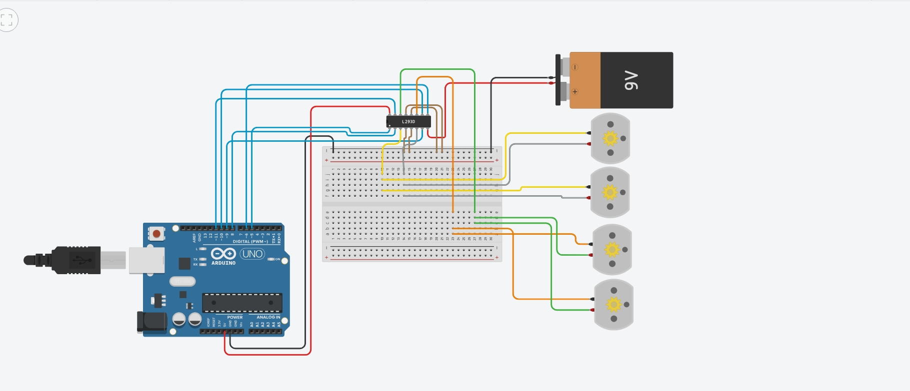

# Arduino Four DC Motors Control

## Overview
This project demonstrates a Tinkercad simulation for controlling four DC motors using an Arduino Uno and the L293D motor driver. The circuit is designed to control the direction of multiple DC motors through the Arduino digital pins.

## Components Used
- Arduino Uno
- L293D Motor Driver
- 4 DC Motors
- Breadboard
- 9V Battery
- Jumper Wires

## Project Features
- Control four DC motors.
- Motor direction control using the L293D driver.
- Arduino-based motor control.
- Designed and tested using Tinkercad.

## Circuit Diagram

## Tinkercad Simulation
Tinkercad Project:
https://www.tinkercad.com/things/gqcRKPkMDB6-frantic-borwo/editel?returnTo=https%3A%2F%2Fwww.tinkercad.com%2Fdashboard

## Author
**Feras Alzahrani**
